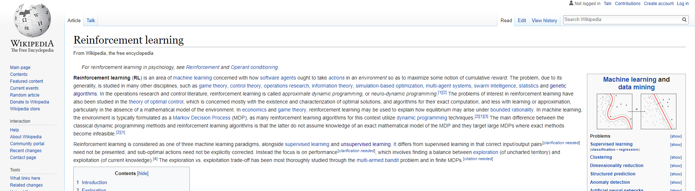
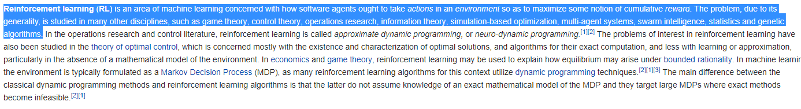
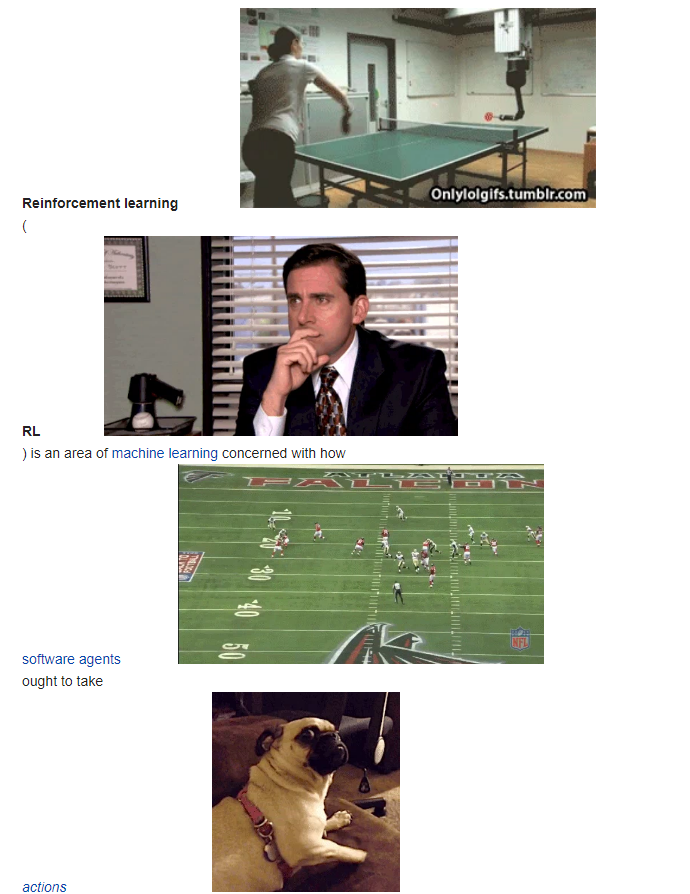

# gifSummarizer

A chrome extension that will take text and show the user a series of related gifs from the giphy api.

# Example

gifSummarizer can be applied to any highlighted text throught a context menu.

On a right click the gifSummarizer option will show up if text is highlighted

The extension will add gifs where appropriate to the highlighted portion.

